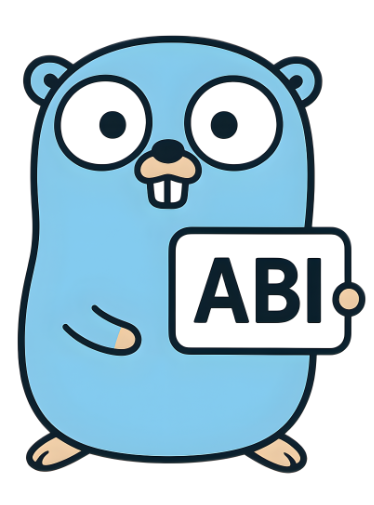

# abi

[](https://pkg.go.dev/github.com/blocky/abi)
[](https://goreportcard.com/report/github.com/blocky/abi)
[](https://golang.org/dl/)

<p align="center">
  
</p>

A minimal Go library for **ABI encoding and decoding** without reflection or code generation.

## Why abi?

- 🚀 **Zero dependencies** (except testing)
- ⚡ **No reflection** - fast and predictable performance
- 🔧 **No code generation** - simple integration
- 📏 **ABI compliant** - follows Ethereum ABI encoding standards
- 🧪 **Well tested** - comprehensive test suite
- 📦 **Lightweight** - minimal API surface

## Quick Start

### Installation

```bash
go get github.com/blocky/abi
```

### Basic Usage

```go
package main

import (
    "fmt"
    "log"

    "github.com/blocky/abi"
)

func main() {
    // Encode a tuple (uint64, bytes, uint64)
    encoded, err := abi.NewTupleEncoder().
        Uint64(42).
        Bytes([]byte("hello world")).
        Uint64(123).
        Encode()
    if err != nil {
        log.Fatal(err)
    }
    fmt.Printf("Encoded tuple: %x\n", encoded)

    // Decode the tuple back
    var num1 uint64
    var data []byte
    var num2 uint64

    err = abi.NewTupleDecoder().
        Uint64(&num1).
        Bytes(&data).
        Uint64(&num2).
        Decode(encoded)
    if err != nil {
        log.Fatal(err)
    }

    fmt.Printf("Decoded: %d, %s, %d\n", num1, data, num2)
    // Output: 
    // Decoded: 42, hello world, 123
}
```

### Simple Types

```go
// Encode/decode individual types
encoded := abi.EncodeUint64(42)
decoded, err := abi.DecodeUint64(encoded)

encodedBytes, err := abi.EncodeBytes([]byte("hello"))
decodedBytes, err := abi.DecodeBytes(encodedBytes)
```

## Features

### Supported ABI Types

- **`uint64`** - 64-bit unsigned integers
- **`bytes`** - Dynamic byte arrays
- **`[]bytes`** - Array of bytes arrays
- **Tuples** - Complex structures combining multiple types

With more planned, feel free to open an issue or PR!

## Development

If you have nix installed, you can create a development environment with:

```bash
nix develop
```
Or set up your environment manually by installing standard Go tools and `just`.

### Running Tests

```bash
# Run all tests
go test ./...

# or use just
just test
```

### Project Structure

```
├── abi.go               # Main library code
├── abi_test.go          # Public API tests
├── abi_internal_test.go # Internal function tests
├── abitestdata_test.go  # Test data and fixtures
└── assets/              # Documentation assets
```

To maintain compatibility with the ethereum ABI standard, we test against
outputs from the [go-ethereum](https://github.com/ethereum/go-ethereum)
library.  We generate these outputs using the `abi-testdata` tool, which
is developed in [abi-testdata](https://github.com/blocky/abi-testdata).
If you would like to add new types, you will likely need to update that
project to add additional test data.

### Contributing

1. Fork the repository
2. Create a feature branch (`git checkout -b feature/amazing-feature`)
3. Make your changes
4. Add tests for new functionality
5. Ensure all tests pass (`just pre-pr`)
6. Commit your changes (`git commit -am 'Add amazing feature'`)
7. Push to the branch (`git push origin feature/amazing-feature`)
8. Open a Pull Request
